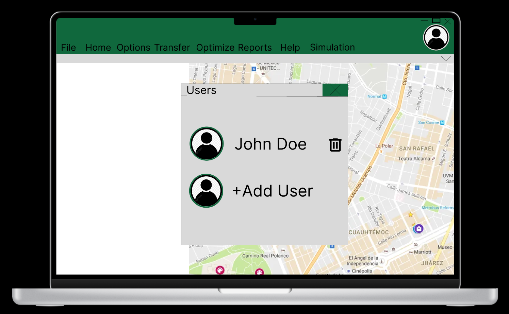
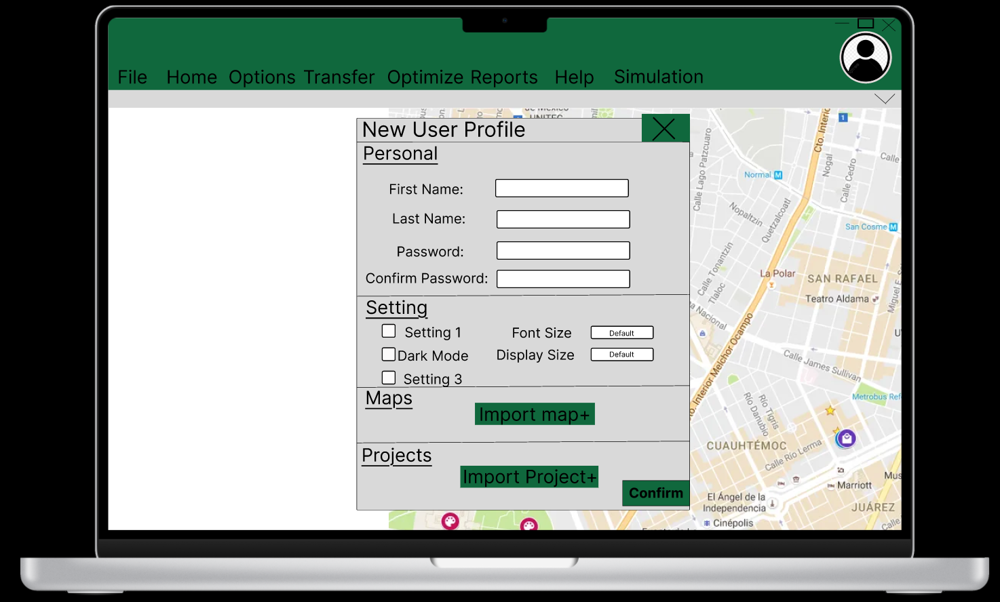
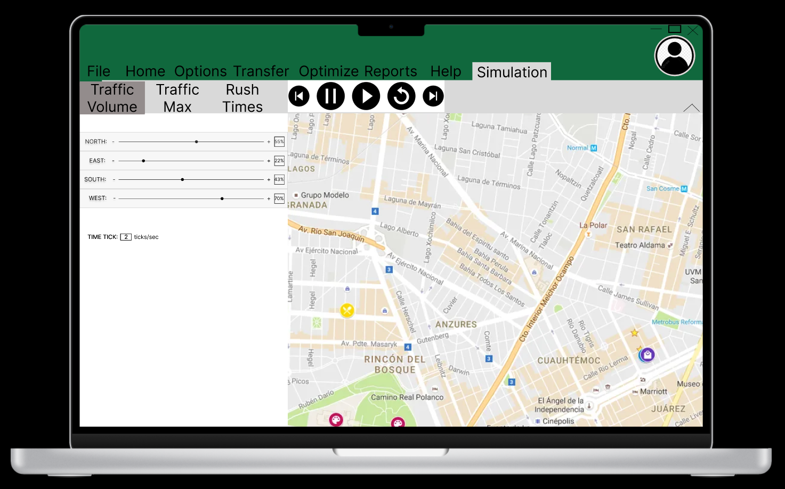
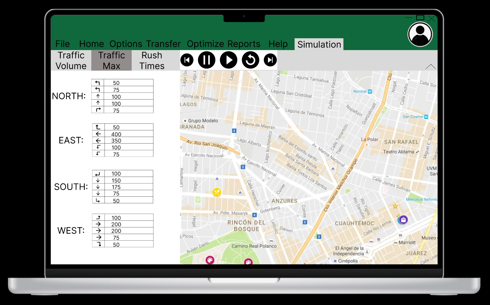
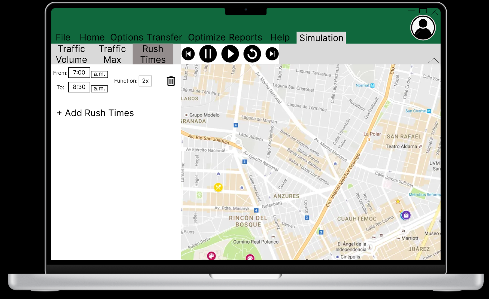

# SynchroStudioProject

# SynchroShift

## Design n' Resign
### Alex Ewing, Michael Castro, Owen Orlic, Thomas Le, Tairan Zhang

## Problem and Design Overview

After taking time to watch students use Synchro Studio, our group settled on two main problems to address: 
1. The lack of a profile system that allows the user to save preferences, projects, etc.
2. The confusing traffic simulation

We decided to implement a user profile system that would allow users to have a place to locally save their previous projects, maps, and system preferences to allow for a more user friendly experience. For the traffic simulation, we did a full redesign to attempt to make the simulation functionality much more present and easy to understand for the user. To complete this, we made a whole tab dedicated to simulations to allow for organization and clarity of how to use the functionality.

## Design Walkthrough

### Add User Profiles

Currently, there is no way of saving individual preferences and settings on a network. In our redesign, the user will click the profile button in the top right corner and then create a profile in the dialogue screen that proceeds the list of users. This will add the user to the list of users. From the users screen you can modify (protected by password) or delete (protected by password) existing users from this screen.

### Restructure Simulation Interface

The current implementation of traffic simulation is vague and confusing. The user will select the simulation tab and navigate to one of the three subtabs (“Traffic Volume”, “Traffic Max”, & “Rush Times”) depending on the aspect of the simulation that they wish to modify. Once the user is finished modifying the simulation settings, they can interact with one of the simulation playback buttons (“Rewind”, “Pause”, “Play”, “Restart”, & “Fast Forward”) to run the simulation.

## Design Research and Key Insights

## Iterative Design and Key Insights

## Technical and Soft Skills Gained

