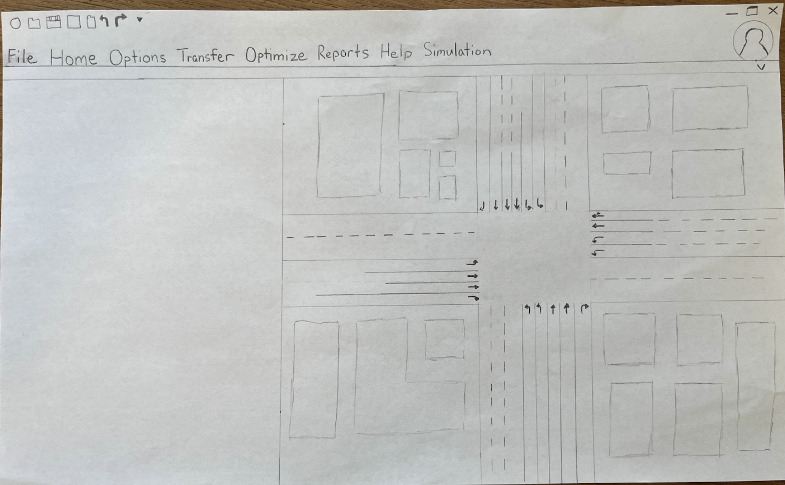

# SynchroStudioProject

# SynchroShift

## Design n' Resign
### Alex Ewing, Michael Castro, Owen Orlic, Thomas Le, Tairan Zhang

## Problem and Design Overview

After taking time to watch students use Synchro Studio, our group settled on two main problems to address: 
1. The lack of a profile system that allows the user to save preferences, projects, etc.
2. The confusing traffic simulation

We decided to implement a user profile system that would allow users to have a place to locally save their previous projects, maps, and system preferences to allow for a more user friendly experience. For the traffic simulation, we did a full redesign to attempt to make the simulation functionality much more present and easy to understand for the user. To complete this, we made a whole tab dedicated to simulations to allow for organization and clarity of how to use the functionality.

## Design Walkthrough

## Design Research and Key Insights

## Iterative Design and Key Insights

## Technical and Soft Skills Gained

