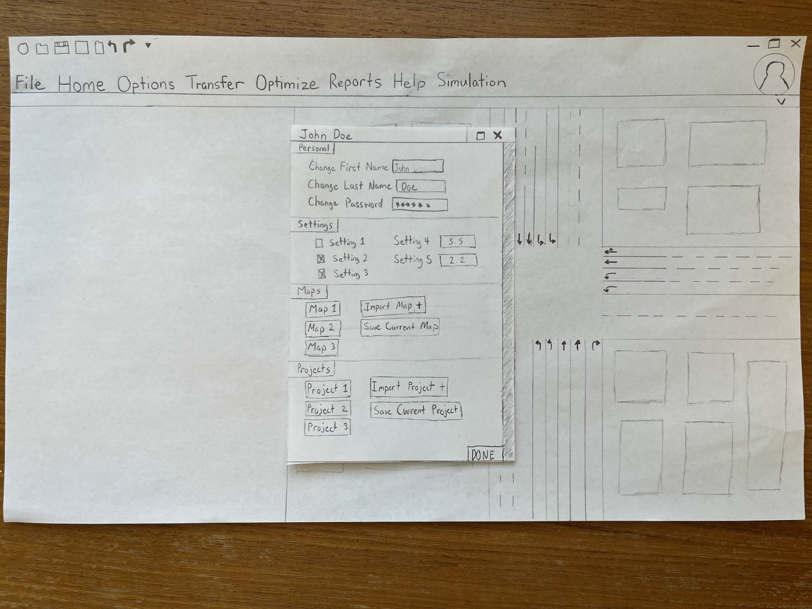
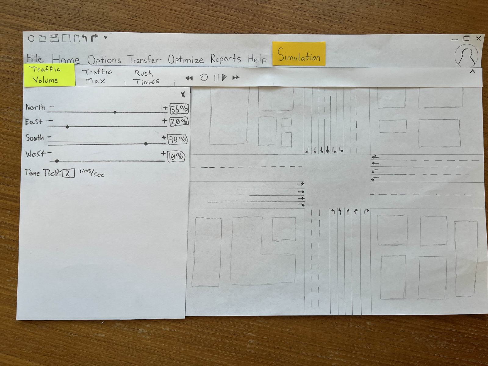

# SynchroStudioProject

# SynchroShift

## Design n' Resign
### Alex Ewing, Michael Castro, Owen Orlic, Thomas Le, Tairan Zhang

## Problem and Design Overview

After taking time to watch students use Synchro Studio, our group settled on two main problems to address: 
1. The lack of a profile system that allows the user to save preferences, projects, etc.
2. The confusing traffic simulation

We decided to implement a user profile system that would allow users to have a place to locally save their previous projects, maps, and system preferences to allow for a more user friendly experience. For the traffic simulation, we did a full redesign to attempt to make the simulation functionality much more present and easy to understand for the user. To complete this, we made a whole tab dedicated to simulations to allow for organization and clarity of how to use the functionality.

## Design Walkthrough

### Add User Profiles

Currently, there is no way of saving individual preferences and settings on a network. In our redesign, the user will click the profile button in the top right corner and then create a profile in the dialogue box that proceeds the list of users. From this dialogue box, the user can save certain settings, such as defaulting to a light or dark mode, import maps they will frequently use, and import current or past projects they want stored with their profile. Once completed, the user can select confirm and be added to the list of users. From the users screen you can modify (protected by password) or delete (protected by password) existing users from this screen.

### Restructure Simulation Interface

The current implementation of traffic simulation is vague and confusing. The user will select the simulation tab and navigate to one of the three subtabs (“Traffic Volume”, “Traffic Max”, & “Rush Times”) depending on the aspect of the simulation that they wish to modify. Traffic Volume controls how much traffic is flowing (0% to 100%) from a direction at the selected intersection. Traffic Max controls the max amount of traffic that a certain lane will produce. Traffic Volume and Traffic Max are heavily connected. If the user pushes the North slider on the Traffic Volume screen to 100%, then the amount of traffic produced will be what is currently selected on the Traffic Max screen. If the user pushes that slider to 50%, then the amount of traffic produced will be half of what is currently selected on the Traffic Max screen. Rush Times allows the user to designate current times in the simulation where the amount of traffic can fluxuate. This takes the current amount of traffic flowing through the lanes and multiplies it by the rush time's "function" to either increase or decrease the flow of traffic. Once the user is finished modifying the simulation settings, they can interact with one of the simulation playback buttons (“Rewind”, “Pause”, “Play”, “Restart”, & “Fast Forward”) to run the simulation.

## Design Research and Key Insights

The goal of this research process is to help reimage the user experience, interface, and overall usability of the software Synchro Studio.

The 1st Method we used was Contextual Inquiry.
- We wanted to get insight on how users interact with the software by observing and then following up with some questions for clarity.

2nd Method we used was a Focus group Study
- We wanted to get insight from 3 participants from the TCE 327 on their thoughts of using Synchro Studio software.
Since the participants were new to the software, we would be able to get an understanding of how user friendly the software is to new users.

Key Insights:
- From the focus group, one of the participants explained that they found a tab within the software very helpful to work with. This was the network tab that had all network settings and can be changed within it. We then decided that a user profile, where the user can save and access their preferences, would be similar to that aspect.
- Within the focus group, there wasn’t much else that could provide useful information. Users seemed to be very happy with the way the software was designed. This mostly has to do with the fact that they only touched the software 3 times, giving them little time to find any problems with it. Instead we decided to focus on the problem that our team found. We noticed that the traffic simulator seemed very confusing, so we wanted to make some changes for it that would make it more user friendly.

## Iterative Design and Key Insights

We began with creating a paper prototype that demonstrates our User Profile Task, that will allow users to create a profile for themselves. We then created another for our traffic simulation task, that allows users to perform traffic simulations with a more user friendly design.

We then performed a usability test on our 2 tasks where the group “Women in Stem” tested them.

From the Usability testing we encountered several issues:
- In Profile User Task
    1. The User Icon was small and didn’t seem like an icon for the user.
    2. There wasn’t a way for the user to input a password after creating a profile and signing back into it.
    3. There was no indication of maps/projects successfully being imported
- In Traffic Simulation Task
    1. Within the traffic volume tab, our testers were confused on which buttons to interact with.
    2. Users also didn’t use the “exit” button within each tab

We took all that insight from Usability testing and created a digital prototype of each task with the help of figma. We were only able to get a heuristic evaluation done for our User profile task since our traffic simulation task wasn’t fully complete.
- In User Profile Task
    1. There was no way of confirming the passwords so that the user didn't mistype it.
    2. The User Tab seemed to cluttered
    3. Not enough clarity on what each setting does

Key Insights:
1. More clarity in our User Profile Digital Prototype
    - We found that our user profile prototype caused confusion for the group that conducted a heuristic evaluation on it.
    - We added some details on our settings section to giving the user an idea of that settings can be changes
    - We changed our “done” button to “confirm” . The word “done” seemed vague to users. “Confirm” seemed like the more appropriate word which was recommended by the group that evaluated our prototype.
2. Enlarged User Profile pop up box
    - Was considered too small, so we decided to make it bigger, to avoid any clutter within the sections.
3. Password Verification
    - We added a second input bar that will allow users to retype the password just in case they mistyped it.

## Technical and Soft Skills Gained

### Technical skills 
- Figma
- Usability Testing
- Paper/Digital Prototyping
- Storyboards
- Contextual Inquiry Observation
- Focus Groups

### Soft skills 
- Collaboration
- Feedback Integration
- Time Management
- Internal/Group Conflict Management
- Creative Problem Solving
- Product Evaluation

